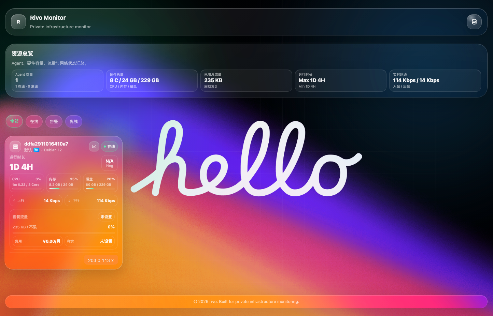
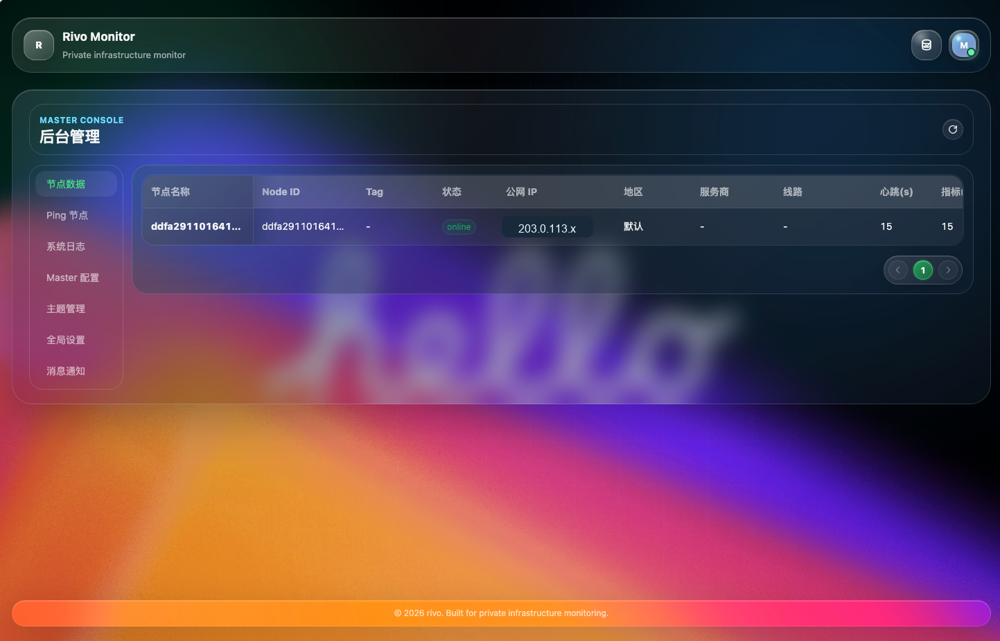
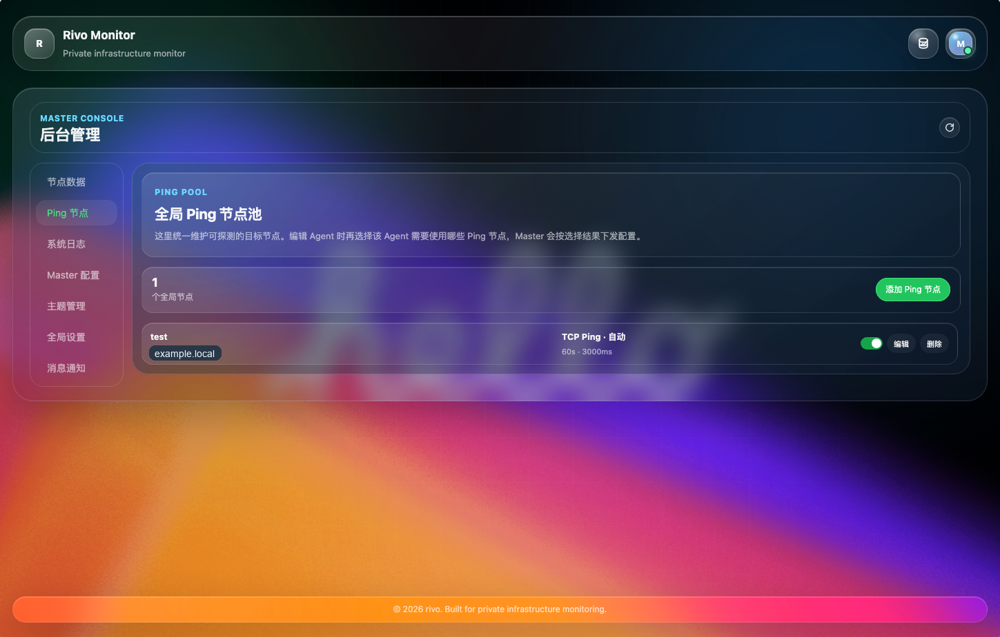
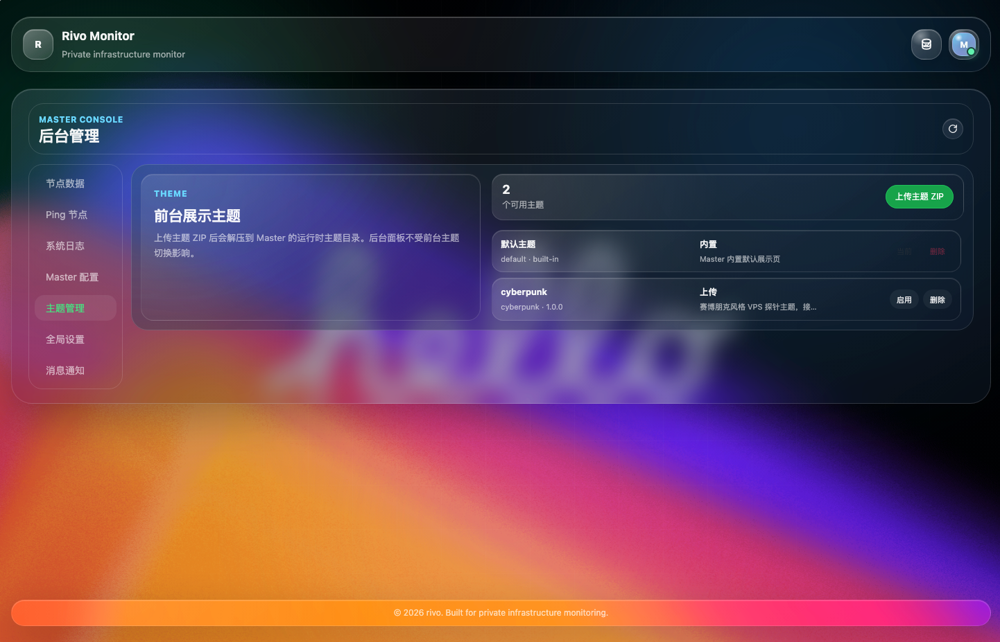
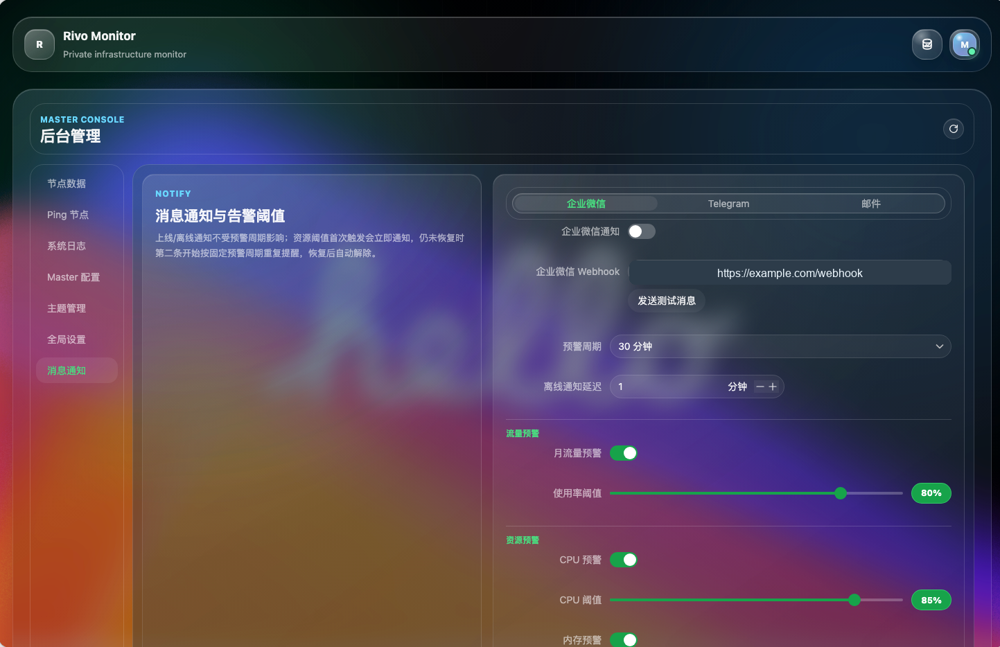
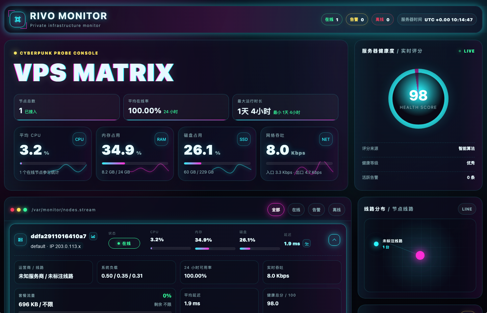

# Rivo

Rivo 是一套面向私有服务器、VPS、LXC 容器和小规模基础设施的轻量级自托管监控面板。

项目由 Go Master、Go Agent 和 Vue 管理面板组成。Agent 通过加密 TCP 长连接接入 Master，负责采集系统指标、执行网络探测、上报快照数据，并接收后台下发的运行配置。

## 快速部署

推荐使用已经发布到 GHCR 的 Docker 镜像部署。Master 负责面板、API、数据库和 Agent 连接管理；Agent 运行在需要监控的服务器上。

默认镜像名：

- `ghcr.io/nyxarrival/rivo-master:latest`
- `ghcr.io/nyxarrival/rivo-agent:latest`

`latest` 镜像来自 `main` 分支，适合测试滚动版本。一键安装默认会解析最新 GitHub Release tag，并使用同一个 tag 安装 Docker 镜像或二进制包。`v*` 标签发布时会先构建 Docker tag 镜像和 Release 二进制，全部成功后才发布 GitHub Release。

如果仓库还没有发布任何 GitHub Release，可以显式传 `--image-tag latest` 使用滚动 Docker 镜像；二进制安装必须依赖 Release 包。

Docker 方式需要先安装 Docker 与 Docker Compose 插件。二进制 Master / Agent 不需要 Docker，但需要 Linux、systemd、`curl` 或 `wget`，以及 `tar`。

### 一键安装

安装脚本会自动生成 `admin_path`、后台密码、`secret_key` 和运行配置，默认安装到 `/opt/rivo/<mode>`。Docker 方式会生成 `compose.yml`，二进制方式会生成 systemd service。

不带参数运行时会进入交互式安装向导，选项可以输入完整单词，也可以输入提示里的字母，例如 `m` 选择 `master`：

```bash
curl -fsSL https://raw.githubusercontent.com/nyxarrival/rivo/main/install.sh | sudo bash
```

交互提示示例：

```text
Action (i=install, u=uninstall) [install]:
Install target (m=master, a=agent, s=single) [master]:
Install method (d=docker, b=binary) [docker]:
```

安装 Master，默认使用 Docker：

```bash
curl -fsSL https://raw.githubusercontent.com/nyxarrival/rivo/main/install.sh | sudo bash -s -- master
```

也可以使用二进制 Master。脚本会自动识别 Linux `amd64` / `arm64`，从最新 GitHub Release 下载对应的 `rivo-master-linux-*.tar.gz`，并注册为 `rivo-master.service`：

```bash
curl -fsSL https://raw.githubusercontent.com/nyxarrival/rivo/main/install.sh | sudo bash -s -- master \
  --method binary
```

安装完成后控制台会输出：

- 前台地址：`http://服务器IP:8080`
- 后台地址：`http://服务器IP:8080/<admin_path>`
- 后台账号和随机密码
- Agent 安装命令

如果输出的 `--master` 是 `172.x`、`10.x`、`192.168.x` 等内网地址，跨服务器部署 Agent 时需要替换成 Agent 能访问到的公网 IP、域名、VPC/VPN 内网地址。

在需要监控的服务器上安装 Agent，默认使用 Docker：

```bash
curl -fsSL https://raw.githubusercontent.com/nyxarrival/rivo/main/install.sh | sudo bash -s -- agent \
  --master MASTER_IP:9443 \
  --secret "MASTER输出的secret_key"
```

也可以使用二进制 Agent。脚本会自动识别 Linux `amd64` / `arm64`，从最新 GitHub Release 下载对应的 `rivo-agent-linux-*.tar.gz`，并注册为 `rivo-agent.service`：

```bash
curl -fsSL https://raw.githubusercontent.com/nyxarrival/rivo/main/install.sh | sudo bash -s -- agent \
  --method binary \
  --master MASTER_IP:9443 \
  --secret "MASTER输出的secret_key"
```

如果 Master 和 Agent 在同一台机器上，也可以单机安装：

```bash
curl -fsSL https://raw.githubusercontent.com/nyxarrival/rivo/main/install.sh | sudo bash -s -- single
```

常用参数：

- `--interactive`：进入交互式安装向导。
- `--http-port 8080`：Master HTTP 端口。
- `--tcp-port 9443`：Agent 接入端口。
- `--admin-path value`：自定义后台路径，必须超过 5 个字符，只能包含英文字母和数字。
- `--admin-password value`：自定义后台密码。
- `--secret value`：自定义 Master 和 Agent 共用密钥。
- `--version v1.0.0`：同时指定 Docker 镜像标签和二进制 Release 版本。
- `--image-tag v1.0.0`：只指定 Docker 镜像标签；传 `latest` 可使用 `main` 分支滚动镜像。
- `--method docker|binary`：Master 或 Agent 安装方式，默认 `docker`；单机模式只支持 Docker。
- `--release-version v1.0.0`：只指定二进制 Master 或 Agent 使用的 Release。
- `--image-owner owner`：覆盖默认镜像和 Release owner，默认 `nyxarrival`。
- `--release-repo owner/repo`：覆盖用于解析最新稳定版本和二进制包的 GitHub Release 仓库。
- `--force`：覆盖脚本生成的配置、Compose 或 systemd service 文件。
- `--purge`：卸载时同时删除 Docker 命名卷；默认会保留 Docker 数据卷。

安装指定版本时，推荐使用统一的 `--version`，这样 Docker 和二进制方式会使用同一个版本：

```bash
curl -fsSL https://raw.githubusercontent.com/nyxarrival/rivo/main/install.sh | sudo bash -s -- agent \
  --version v1.0.0 \
  --master MASTER_IP:9443 \
  --secret "MASTER输出的secret_key"
```

也可以分别覆盖 Docker 镜像标签或二进制 Release 版本：

```bash
curl -fsSL https://raw.githubusercontent.com/nyxarrival/rivo/main/install.sh | sudo bash -s -- agent \
  --method binary \
  --release-version v1.0.0 \
  --master MASTER_IP:9443 \
  --secret "MASTER输出的secret_key"
```

Agent 报 `master closed connection during register handshake` 时，优先检查 Master 和 Agent 使用的 `secret_key` 是否一致。更多说明见 [Agent 说明](docs/agent.md)。

卸载默认会停止并移除 Docker Compose 服务或二进制 Master / Agent 的 systemd 服务，并删除安装目录。Docker 命名卷默认保留，避免误删 Master 数据库和日志；确认要连同 Docker 数据卷一起删除时加 `--purge`。

卸载默认路径下的全部组件：

```bash
curl -fsSL https://raw.githubusercontent.com/nyxarrival/rivo/main/install.sh | sudo bash -s -- uninstall
```

也可以只卸载指定模式：

```bash
curl -fsSL https://raw.githubusercontent.com/nyxarrival/rivo/main/install.sh | sudo bash -s -- uninstall master
curl -fsSL https://raw.githubusercontent.com/nyxarrival/rivo/main/install.sh | sudo bash -s -- uninstall agent
curl -fsSL https://raw.githubusercontent.com/nyxarrival/rivo/main/install.sh | sudo bash -s -- uninstall single
```

二进制 Master / Agent 可以显式指定卸载方式；如果安装时使用了自定义目录，卸载时传入同一个 `--install-dir`：

```bash
curl -fsSL https://raw.githubusercontent.com/nyxarrival/rivo/main/install.sh | sudo bash -s -- uninstall master --method binary
curl -fsSL https://raw.githubusercontent.com/nyxarrival/rivo/main/install.sh | sudo bash -s -- uninstall agent --method binary
curl -fsSL https://raw.githubusercontent.com/nyxarrival/rivo/main/install.sh | sudo bash -s -- uninstall master --install-dir /opt/custom-rivo
```

### 手动 Docker Compose

如果不想使用安装脚本，可以使用 `deploy/` 里的 Compose 和 Makefile 统一部署。

首次使用先复制示例配置：

```bash
cp deploy/master/.env.example deploy/master/.env
cp deploy/master/config.example.yaml deploy/master/config.yaml
cp deploy/agent/.env.example deploy/agent/.env
```

启动前需要编辑：

- `deploy/master/config.yaml`：至少修改 `tcp.secret_key`、`auth.password` 和 `http.admin_path`。
- `deploy/master/.env`：配置 Master 镜像、端口、数据库和配置文件挂载路径。
- `deploy/agent/.env`：配置 `RIVO_MASTER_ADDR` 和与 Master 一致的 `RIVO_SECRET_KEY`。

启动 Master 和 Agent：

```bash
make -f deploy/Makefile compose-master-up
make -f deploy/Makefile compose-agent-up
```

MySQL、本地镜像构建和单二进制构建见 [部署说明](deploy/README.md)。

### 二进制 Release

如果不使用 Docker，可以从 GitHub Release 下载二进制包。Master 二进制已经内嵌后台和默认主题静态资源。

Release 会包含：

- `rivo-master-linux-amd64.tar.gz`
- `rivo-master-linux-arm64.tar.gz`
- `rivo-agent-linux-amd64.tar.gz`
- `rivo-agent-linux-arm64.tar.gz`
- `rivo-master-darwin-amd64.tar.gz`
- `rivo-master-darwin-arm64.tar.gz`
- `rivo-agent-darwin-amd64.tar.gz`
- `rivo-agent-darwin-arm64.tar.gz`
- `checksums.txt`

Master：

```bash
VERSION=v1.0.0
OS=linux # linux / darwin
ARCH=amd64 # amd64 / arm64
curl -LO "https://github.com/nyxarrival/rivo/releases/download/${VERSION}/rivo-master-${OS}-${ARCH}.tar.gz"
tar -xzf "rivo-master-${OS}-${ARCH}.tar.gz"
cd "rivo-master-${OS}-${ARCH}"
cp config.example.yaml config.yaml
./rivo-master -config config.yaml
```

Agent：

```bash
VERSION=v1.0.0
OS=linux # linux / darwin
ARCH=amd64 # amd64 / arm64
curl -LO "https://github.com/nyxarrival/rivo/releases/download/${VERSION}/rivo-agent-${OS}-${ARCH}.tar.gz"
tar -xzf "rivo-agent-${OS}-${ARCH}.tar.gz"
cd "rivo-agent-${OS}-${ARCH}"
cp config.example.yaml config.yaml
./rivo-agent -config config.yaml
```

macOS 运行下载的二进制时，可能需要按系统提示允许来自终端的可执行文件。

## 界面预览

<p>
  
</p>
<p>
  
</p>
<p>
  
</p>
<p>
  
</p>
<p>
  
</p>
<p>
  
</p>

## 核心功能

- Agent 首次连接自动注册，支持固定或自动生成 `node_id`。
- Master 可从后台下发 Agent 运行配置，包含心跳、指标、Ping 任务和快照采集策略。
- 采集 CPU、负载、内存、Swap、磁盘、运行时长、网络速率和累计流量。
- 支持 TCP Ping、ICMP Ping，支持 IPv4、IPv6 和 Auto 模式，以及按 Agent 选择探测任务。
- 支持进程与连接快照，可按需开启敏感信息脱敏。
- 支持节点地区、服务商、线路、Tag、公网 IPv4/IPv6 和多公网 IP 记录。
- 支持 VPS 套餐资产管理：付费周期、价格、币种、服务周期、套餐流量、已用流量、剩余流量和剩余价值。
- 支持离线、流量、CPU、内存、磁盘、负载、服务到期等告警。
- 支持企业微信、Telegram 和 SMTP 邮件通知，SMTP 支持无加密、STARTTLS 和 SSL/TLS。
- 支持前台主题上传与切换，内置默认主题和 Cyberpunk 主题。
- 支持自定义后台访问路径，首次使用配置文件，后续可在后台修改。
- 支持系统日志、指标数据和 Ping 数据保留周期配置。
- 支持 SQLite 快速部署，也支持 MySQL 持久化部署。

## 架构

```text
Browser
  |
  | HTTP :8080
  v
Master
  |-- API + Panel
  |-- SQLite / MySQL
  |-- alerts, logs, assets, retention
  |
  | encrypted TCP :9443
  v
Agent
  |-- metrics collector
  |-- TCP / ICMP probe worker
  |-- process and connection snapshot collector
```

Master 负责面板、API、数据库、告警、日志、配置下发和 Agent 会话管理。Agent 负责采集本机数据，并通过 ChaCha20-Poly1305 加密协议上报给 Master。

## 源码运行

源码运行更适合开发和调试。正式部署建议优先使用 Docker Compose。

```bash
go run ./cmd/master -config configs/master.example.yaml
go run ./cmd/agent -config configs/agent.example.yaml
```

使用源码运行前，同样需要把 `configs/master.example.yaml` 和 `configs/agent.example.yaml` 里的 `secret_key` 改成同一个随机密钥。

## 开发

前端开发：

```bash
cd panel
pnpm install
pnpm dev
```

常用命令：

```bash
go test ./...
make build
make -f deploy/Makefile build
```

正式构建的 Master 二进制会通过 Go embed 内嵌 Panel 静态资源。前台主题 ZIP 包需要包含 `theme.json` 和 `dist/index.html`。

## 文档

- [部署说明](deploy/README.md)：Docker、Compose、Makefile、MySQL 和正式打包。
- [配置说明](docs/configuration.md)：Master 和 Agent 配置项。
- [Agent 说明](docs/agent.md)：`node_id`、`state_file`、公网 IP 嗅探和多 Agent 运行。
- [通信协议](docs/protocol.md)：注册握手、密钥派生、消息加密和数据流。

## 安全注意事项

- 生产环境必须替换示例 `secret_key`。
- `http.admin_path` 建议使用随机字符串，且长度必须超过 5 个字符。
- 必须修改默认后台密码。
- 不要提交运行时配置、数据库文件、日志文件或 Agent 状态文件。
- 尽量通过防火墙或反向代理规则限制 `8080` 和 `9443` 的访问范围。
- 进程与连接快照可能包含敏感进程名、端口和地址；多人查看面板时建议开启脱敏。

## 目录结构

```text
cmd/master                 Master 入口
cmd/agent                  Agent 入口
internal/master/api         HTTP API 和 Panel 路由
internal/master/tcp         Master TCP 服务
internal/agent              Agent 客户端、配置和采集器
internal/protocol           加密通信协议
panel                       Vue 后台面板和默认前台
themes/cyberpunk            Cyberpunk 前台主题
configs                     配置示例
migrations                  初始化 SQL
deploy                      Docker 和正式构建文件
```

## 项目状态

Rivo 仍处于快速开发阶段，数据库结构、后台设置和 Agent 运行配置可能继续调整。

## License

Rivo 使用 [GNU Affero General Public License v3.0 or later](LICENSE) 开源。

这意味着如果你修改 Rivo 并通过网络服务提供给用户使用，也需要向这些用户提供对应修改版本的源代码。
